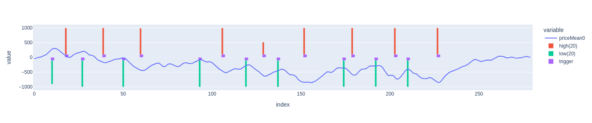

This directory contains subdirectories with graphical output of the prediction results:

#### [In this subdirectory the charts of the prediction results on the test series 1 are placed](testseries_1)

Prediciton chart of 67 days modell (first chart) and 50 days model (second chart) on November 18, 2024\
Limit  , HI 67 , precision , 0,400 , sum_pl , 68,2 , max_pl , 37,7 , min_pl , -2,2\
Limit  , LO 67 , precision , 1,000 , sum_pl , 30,0 , max_pl , 23,2 , min_pl , 0,0\

#### [In this subdirectory the charts of the prediction results on the test series 2 are placed](testseries_2)

The charts below show the results for 83 days in the big charts and in the small charts the results for 50 days.
In addition, the performance results of the limit trading strategy for the 83 days model are added.

This directory contains some example charts of the prediction results on trained days. The charts are shown below:

Prediciton chart of 83 days modell (first chart) and 50 days model (second chart) on September 24, 2024\
Limit  , HI 83 , precision : 0,667 , sum_pl ; 134,9, max_pl : 72,9 : min_pl , -5,0\
Limit  , LO 83 , precision : 0,800 , sum_pl : 63,1 , max_pl : 19,3 , min_pl : 0,0\

#### [In this subdirectory the charts of some prediction results on trained data are placed](trained_d91)

And also one subdirectorie some prediction results on trained data.\
Prediciton chart of 91 days modell on September 24, 2024\

