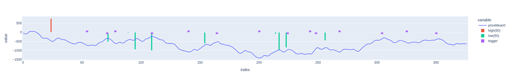

This directory contains subdirectories with graphical output of the prediction results:

#### [testseries_1: In this subdirectory the charts of the prediction results on the test series 1 are placed](testseries_1)

As an example the prediciton chart of 83 days modell (first chart) and 50 days model (second chart) on September 24, 2024 is shown\
Limit  , HI 83 , precision : 0,667 , sum_pl ; 134,9, max_pl : 72,9 : min_pl , -5,0\
Limit  , LO 83 , precision : 0,800 , sum_pl : 63,1 , max_pl : 19,3 , min_pl : 0,0\

#### [testseries_2: In this subdirectory the charts of the prediction results on the test series 2 are placed](testseries_2)

As an example the prediciton chart of 67 days modell (first chart) and 50 days model (second chart) on November 18, 2024 is shown\
Limit  , HI 67 , precision , 0,400 , sum_pl , 68,2 , max_pl , 37,7 , min_pl , -2,2\
Limit  , LO 67 , precision , 1,000 , sum_pl , 30,0 , max_pl , 23,2 , min_pl , 0,0\

#### [trained_d91: In this subdirectory the charts of some prediction results on trained data are placed](trained_d91)

As an example the prediciton chart of the 91 days modell on September 24, 2024 is shown\

