This directory contains the charts of the prediction results on the test series 1 for the 83 and the 50 days models.
The charts below show the results for 83 days in the big charts and in the small charts the results for 50 days.
In addition, the performance results of the limit trading strategy for the 83 days model are added.

Prediciton chart of 83 days modell (first chart) and 50 days model (second chart) on September 2, 2024\
Limit  , HI 83 , precision : 1,000 , sum_pl ; 27,6 , max_pl : 27,6 : min_pl , 0,0\
Limit  , LO 83 , precision : 0,000 , sum_pl : 2,9 ,  max_pl : 2,9 ,  min_pl : 0,0\

Prediciton chart of 83 days modell (first chart) and 50 days model (second chart) on September 4, 2024\
Limit  , HI 83 , precision : 0,250 , sum_pl ; 7,5 ,  max_pl : 23,3 : min_pl , -6,0\
Limit  , LO 83 , precision : 0,000 , sum_pl : -10,2, max_pl : 0,8 ,  min_pl : -11,0\
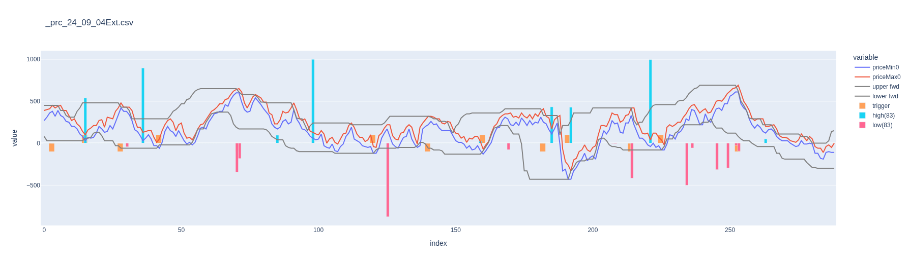
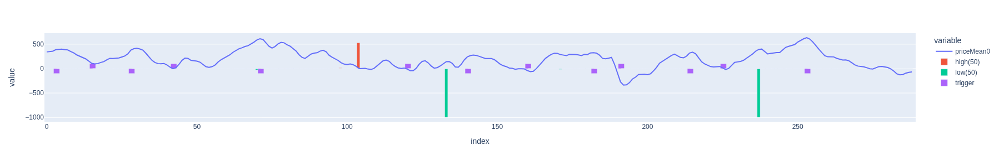

Prediciton chart of 83 days modell (first chart) and 50 days model (second chart) on September 5, 2024\
Limit  , HI 83 , precision : 0,333 , sum_pl ; 9,9 ,  max_pl : 24,4 : min_pl , -9,0\
Limit  , LO 83 , precision : 0,400 , sum_pl : 63,7 , max_pl : 41,9 , min_pl : -4,9\
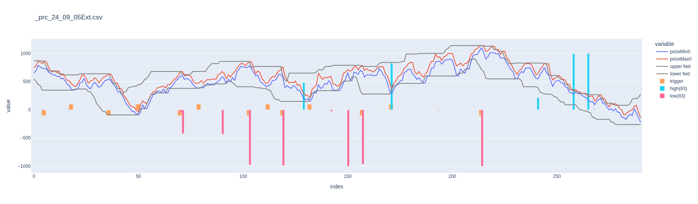
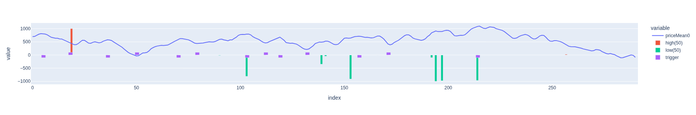

Prediciton chart of 83 days modell (first chart) and 50 days model (second chart) on September 16, 2024\
Limit  , HI 83 , precision : 0,500 , sum_pl ; 109,4, max_pl : 42,7 : min_pl , -5,0\
Limit  , LO 83 , precision : 1,000 , sum_pl : 28,7 , max_pl : 23,4 , min_pl : 0,0\
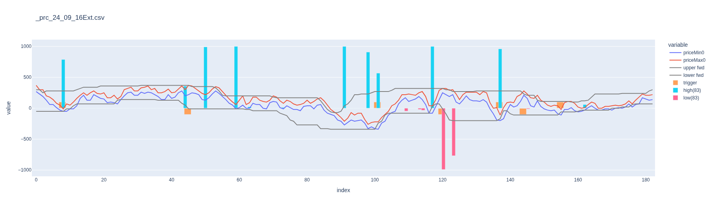
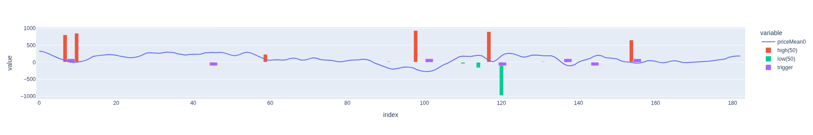

Prediciton chart of 83 days modell (first chart) and 50 days model (second chart) on September 17, 2024\
Limit  , HI 83 , precision : 0,400 , sum_pl ; 35,5 , max_pl : 25,2 : min_pl , -15,0\
Limit  , LO 83 , precision : 0,750 , sum_pl : 108,7, max_pl : 56,6 , min_pl : -4,5\
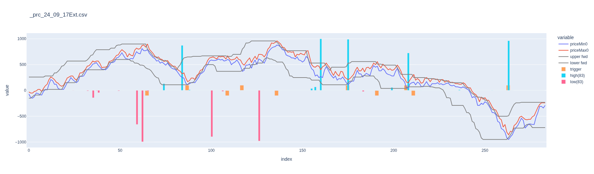
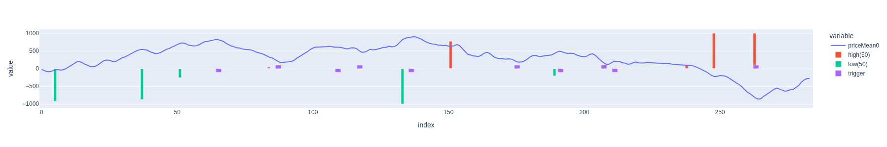

Prediciton chart of 83 days modell (first chart) and 50 days model (second chart) on September 23, 2024\
Limit  , HI 83 , precision : 1,000 , sum_pl ; 45,5 , max_pl : 19,4 : min_pl , 0,0\
Limit  , LO 83 , precision : 0,333 , sum_pl : -5,6 , max_pl : 6,6 ,  min_pl : -15,0\
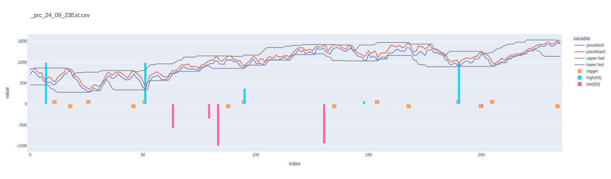
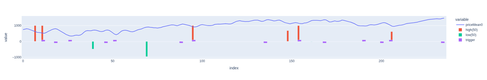

Prediciton chart of 83 days modell (first chart) and 50 days model (second chart) on September 24, 2024\
Limit  , HI 83 , precision : 0,667 , sum_pl ; 134,9, max_pl : 72,9 : min_pl , -5,0\
Limit  , LO 83 , precision : 0,800 , sum_pl : 63,1 , max_pl : 19,3 , min_pl : 0,0\
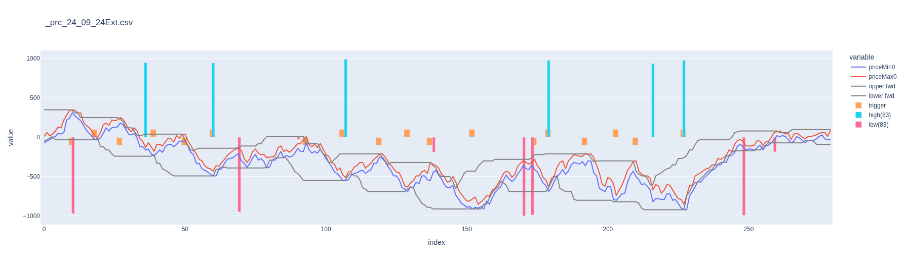
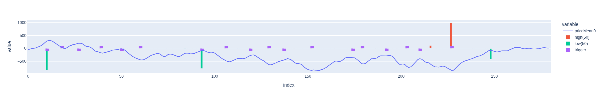

Prediciton chart of 83 days modell (first chart) and 50 days model (second chart) on September 26, 2024\
Limit  , HI 83 , precision : 0,400 , sum_pl ; 88,1 , max_pl : 89,6 : min_pl , -5,9\
Limit  , LO 83 , precision : 0,333 , sum_pl : 9,9 ,  max_pl : 25,9 , min_pl : -9,5\
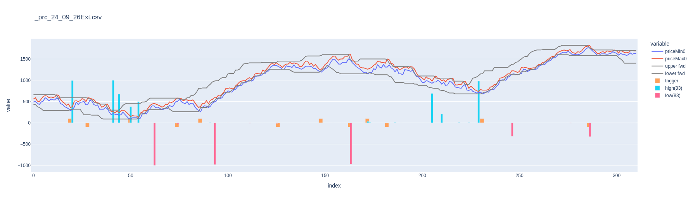
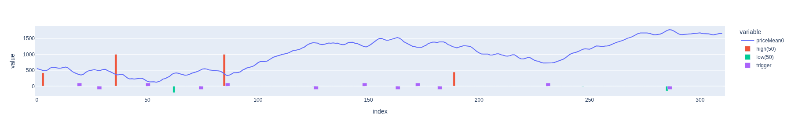
