This directory contains the charts of the prediction results on the test series 2 for the 67 and the 50 days models.
The charts below show the results for 67 days in the big charts and in the small charts the results for 50 days.
In addition, the performance results of the limit trading strategy for the 67 days model are added.

Prediciton chart of 67 days modell (first chart) and 50 days model (second chart) on October 18, 2024\
Limit  , HI 67 , precision , 0,400 , sum_pl , 22,0 , max_pl , 12,4 , min_pl , -0,9\
Limit  , LO 67 , precision , 0,250 , sum_pl , 12,8 , max_pl , 13,7 , min_pl , -5,0\

Prediciton chart of 67 days modell (first chart) and 50 days model (second chart) on October 23, 2024\
Limit  , HI 67 , precision , 0,250 , sum_pl , 42,5 , max_pl , 33,7 , min_pl , -5,0\
Limit  , LO 67 , precision , 1,000 , sum_pl , 84,2 , max_pl , 63,0 , min_pl , 0,0\

Prediciton chart of 67 days modell (first chart) and 50 days model (second chart) on October 24, 2024\
Limit  , HI 67 , precision , 0,286 , sum_pl , 46,1 , max_pl , 54,4 , min_pl , -5,0\
Limit  , LO 67 , precision , 0,800 , sum_pl , 130,7 , max_pl , 55,4 , min_pl , -5,0\

Prediciton chart of 67 days modell (first chart) and 50 days model (second chart) on October 25, 2024\
Limit  , HI 67 , precision , 1,000 , sum_pl , 38,3 , max_pl , 30,1 , min_pl , 0,0\
Limit  , LO 67 , precision , 0,250 , sum_pl , 17,2 , max_pl , 16,0 , min_pl , -5,5\

Prediciton chart of 67 days modell (first chart) and 50 days model (second chart) on October 29, 2024\
Limit  , HI 67 , precision , 0,286 , sum_pl , -0,9 , max_pl , 12,7 , min_pl , -6,5\
Limit  , LO 67 , precision , 0,600 , sum_pl , 69,8 , max_pl , 38,2 , min_pl , -5,0\

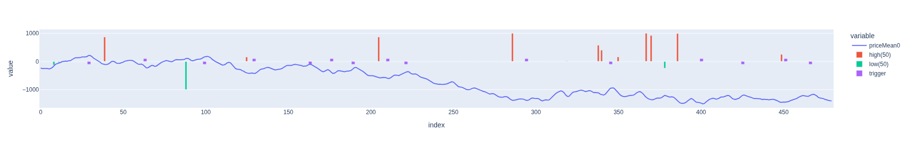

Prediciton chart of 67 days modell (first chart) and 50 days model (second chart) on October 30, 2024\
Limit  , HI 67 , precision , 0,250 , sum_pl , 35,5 , max_pl , 53,7 , min_pl , -12,0\
Limit  , LO 67 , precision , 0,600 , sum_pl , 69,8 , max_pl , 38,2 , min_pl , -5,0\

Prediciton chart of 67 days modell (first chart) and 50 days model (second chart) on October 31, 2024\
Limit  , HI 67 , precision , 0,250 , sum_pl , 6,8 , max_pl , 20,2 , min_pl , -11,3\
Limit  , LO 67 , precision , 0,500 , sum_pl , 45,5 , max_pl , 20,3 , min_pl , -3,5\

Prediciton chart of 67 days modell (first chart) and 50 days model (second chart) on November 1, 2024\
Limit  , HI 67 , precision , 0,800 , sum_pl , 75,5 , max_pl , 32,5 , min_pl , -5,0\
Limit  , LO 67 , precision , 0,500 , sum_pl , 2,8 , max_pl , 7,6 , min_pl , -4,8\

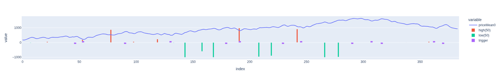

Prediciton chart of 67 days modell (first chart) and 50 days model (second chart) on November 4, 2024\
Limit  , HI 67 , precision , 0,500 , sum_pl , 52,2 , max_pl , 38,2 , min_pl , -5,0\
Limit  , LO 67 , precision , 0,500 , sum_pl , 13,9 , max_pl , 18,7 , min_pl , -13,0\
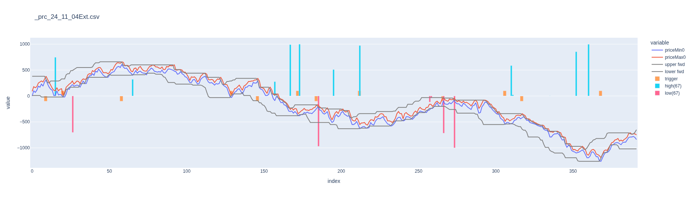

Prediciton chart of 67 days modell (first chart) and 50 days model (second chart) on November 5, 2024\
Limit  , HI 67 , precision , 0,400 , sum_pl , 34,3 , max_pl , 32,4 , min_pl , -5,2\
Limit  , LO 67 , precision , 0,000 , sum_pl , -18,2 , max_pl , 0,5 , min_pl , -10,3\
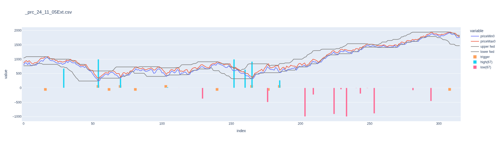
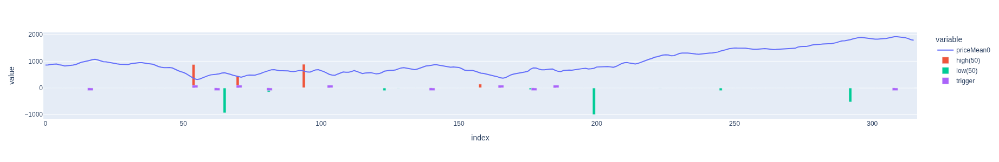

Prediciton chart of 67 days modell (first chart) and 50 days model (second chart) on November 11, 2024\
Limit  , HI 67 , precision , 0,500 , sum_pl , 32,3 , max_pl , 22,6 , min_pl , -4,9\
Limit  , LO 67 , precision , 0,333 , sum_pl , 9,5 , max_pl , 13,9 , min_pl , -5,0\
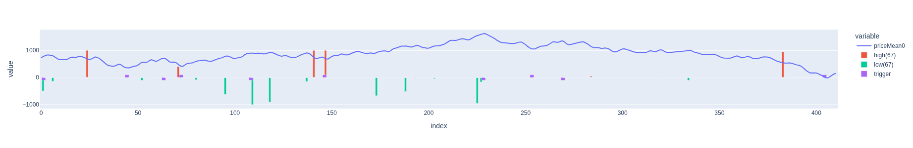
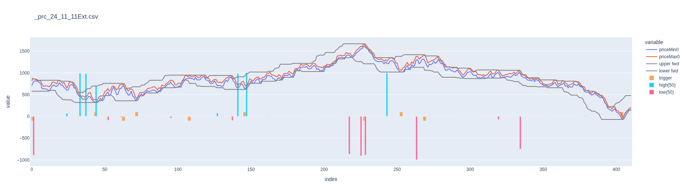

Prediciton chart of 67 days modell (first chart) and 50 days model (second chart) on November 13, 2024\
Limit  , HI 67 , precision , 0,500 , sum_pl , 24,8 , max_pl , 25,6 , min_pl , -12,6\
Limit  , LO 67 , precision , 0,000 , sum_pl , -25,1 , max_pl , 0,0 , min_pl , -7,1\
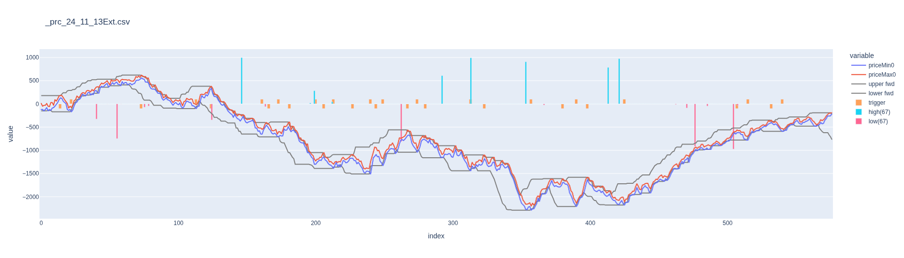
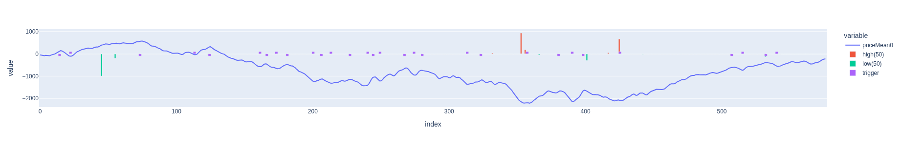

Prediciton chart of 67 days modell (first chart) and 50 days model (second chart) on November 15, 2024\
Limit  , HI 67 , precision , 0,600 , sum_pl , 72,1 , max_pl , 37,5 , min_pl , -5,0\
Limit  , LO 67 , precision , 0,750 , sum_pl , 111,1 , max_pl , 55,2 , min_pl , 0,0\
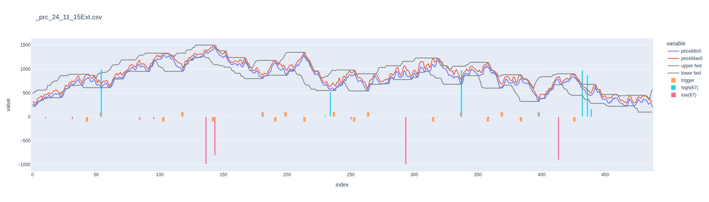
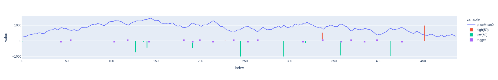

Prediciton chart of 67 days modell (first chart) and 50 days model (second chart) on November 18, 2024\
Limit  , HI 67 , precision , 0,400 , sum_pl , 68,2 , max_pl , 37,7 , min_pl , -2,2\
Limit  , LO 67 , precision , 1,000 , sum_pl , 30,0 , max_pl , 23,2 , min_pl , 0,0\
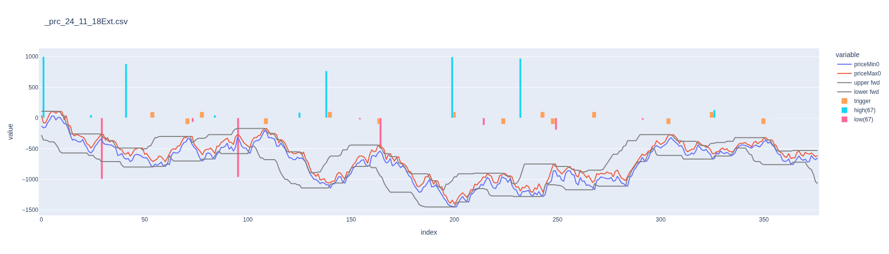

Prediciton chart of 67 days modell (first chart) and 50 days model (second chart) on November 20, 2024\
Limit  , HI 67 , precision , 0,375 , sum_pl , 117,7 , max_pl , 67,1 , min_pl , -10,0\
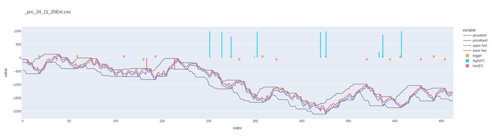
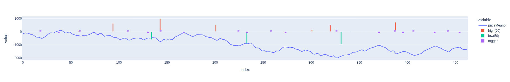

Prediciton chart of 67 days modell (first chart) and 50 days model (second chart) on November 21, 2024\
Limit  , HI 67 , precision , 0,444 , sum_pl , 179,9 , max_pl , 77,8 , min_pl , -8,9\
Limit  , LO 67 , precision , 1,000 , sum_pl , 19,0 , max_pl , 10,0 , min_pl , 0,0\
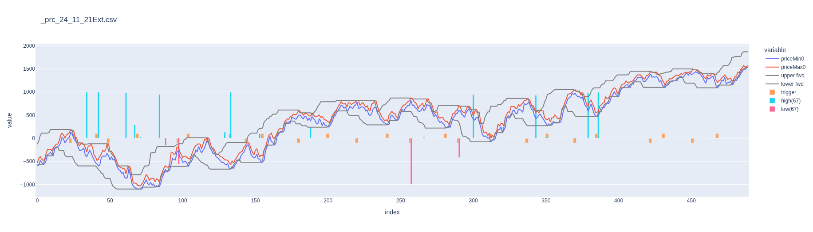
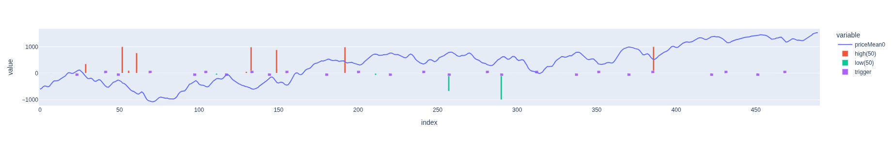

Prediciton chart of 67 days modell (first chart) and 50 days model (second chart) on November 25, 2024\
Limit  , HI 67 , precision , 0,500 , sum_pl , 49,1 , max_pl , 34,3 , min_pl , -13,9\
Limit  , LO 67 , precision , 0,667 , sum_pl , 79,1 , max_pl , 34,0 , min_pl , -5,0\
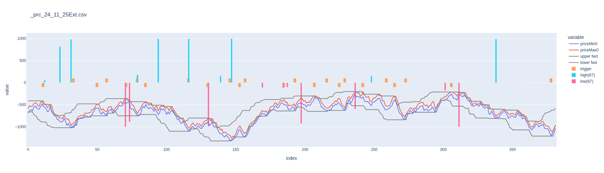
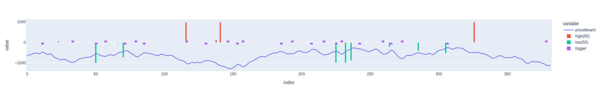

Prediciton chart of 67 days modell (first chart) and 50 days model (second chart) on November 26, 2024\
Limit  , HI 67 , precision , 0,500 , sum_pl , 88,8 , max_pl , 70,2 , min_pl , -5,0\
Limit  , LO 67 , precision , 0,750 , sum_pl , 51,7 , max_pl , 28,3 , min_pl , -8,5\
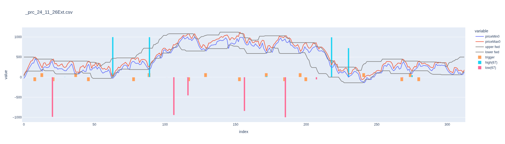
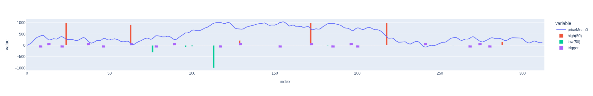

Prediciton chart of 67 days modell (first chart) and 50 days model (second chart) on November 27, 2024\
Limit  , HI 67 , precision , 0,800 , sum_pl , 134,1 , max_pl , 57,0 , min_pl , -5,0\
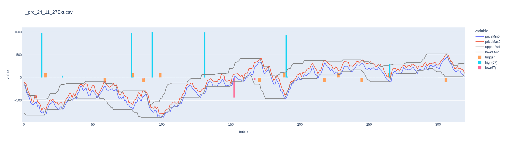
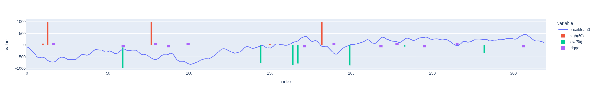
