This directory contains the results as sheets and screenshots.
The details of the test runs are located in the individual subdirectories.

### **Overview of Backtesting Performance: Limit Strategy**
As a short introduction, the overall result of the limit strategy is presented.
The Limit Strategy introduces risk management rules (e.g., stop-loss and trailing stops) to the trades initiated by the model's triggers. A "hit" is recorded if a predicted trigger results in a profit of more than 5 basis points.
This series compares models trained on 83 and 50 days of data.

#### **Test Series 1: September 2024 Period**

The first test series covers 8 trading days from September September 2, 2024, to September 26, 2024.

| Model | Total Trades | Successful Trades (Hits) | Precision of Performance | Total Profit/Loss (Points) |
| ----- | ----- | ----- | ----- | ----- |
| **HI 83** | 35 | 18 | 0.514 | 458,4 |
| **LO 83** | 25 | 13 | 0.520 | 261,2 |
| **HI 50** | 21 | 15 | 0.714 | 362,0 |
| **LO 50** | 16 | 8 | 0.500 | 124,5 |

#### **Test Series 2: October-November 2024 Period**

The second, more extensive test series covers 19 trading days from October 18, 2024, to November 27, 2024. 
This series compares models trained on 67 and 50 days of data.

| Model | Total Trades | Successful Trades (Hits) | Precision of Performance | Total Profit/Loss (Points) |
| ----- | ----- | ----- | ----- | ----- |
| **HI 67** | 107 | 48 | 0.449 | 1119,3 |
| **LO 67** | 70 | 37 | 0.529 | 669,2 |
| **HI 50** | 68 | 29 | 0.426 | 525 |
| **LO 50** | 67 | 24 | 0.358 | 482,7 |

### **Results of Test Series 1**

Results: metrics 83 days modell\
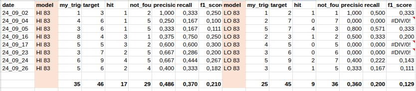

Results: metrics 50 days modell\
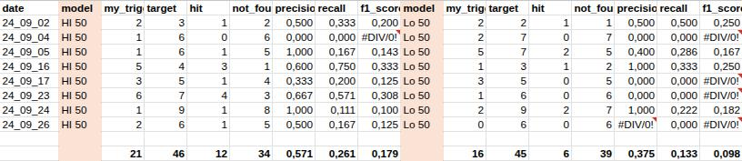

Results: base szenarion 83 days modell\
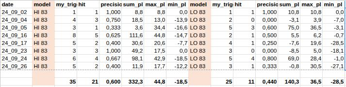

Results: base szenarion 50 days modell\
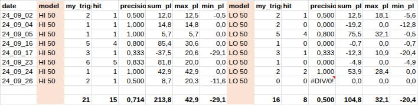

Results: limit szenarion 83 days modell\
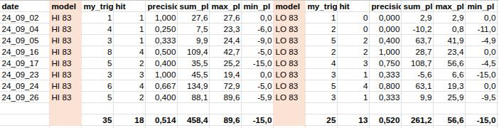

Results: limit szenarion 50 days modell\
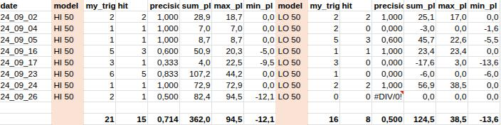

### **Results of Test Series 2**

Results: metrics 67 days modell\
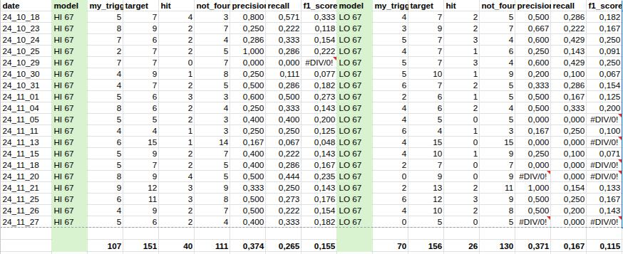

Results: metrics 50 days modell\
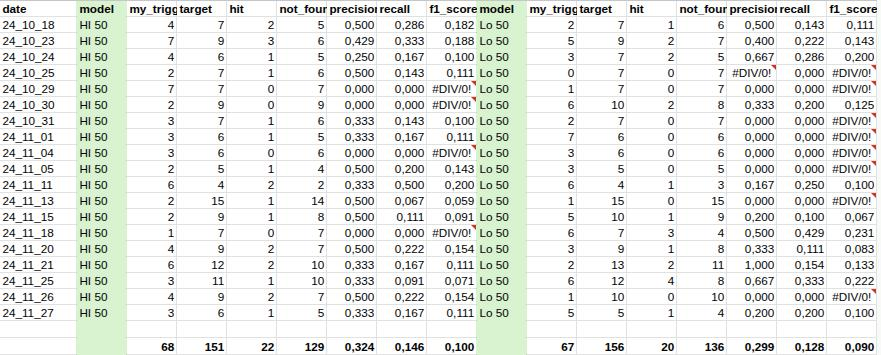

Results: base szenarion 67 days modell\
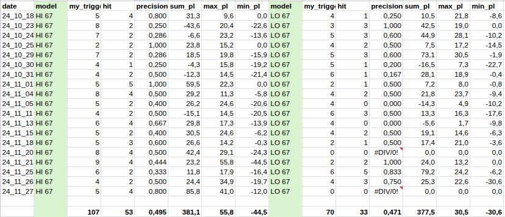

Results: base szenarion 50 days modell\
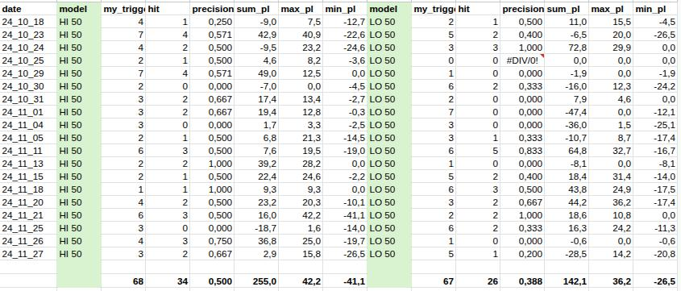

Results: limit szenarion 67 days modell\
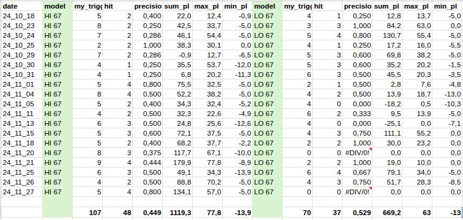

Results: limit szenarion 50 days modell\
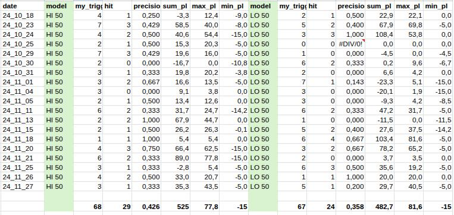

